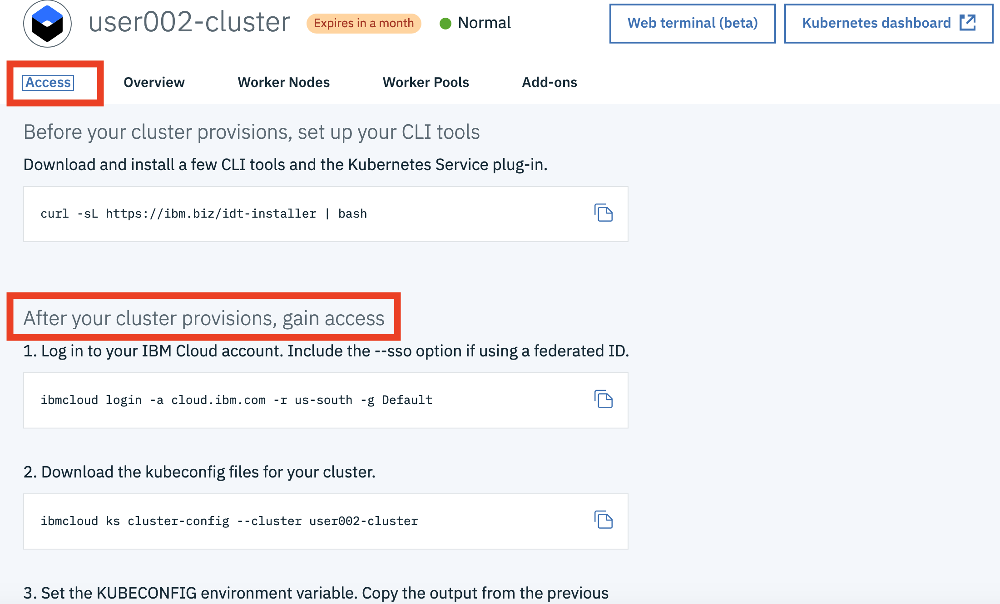

# Lab 0c. Connect to your kubernetes environment

Complete steps in this section to connect to your Kubernetes cluster.

1. Open a terminal window or command window.

2. Login to [Kubernetes service in IBM Cloud](https://cloud.ibm.com/kubernetes/clusters).

3. Select your Kubernetes luster.
 
4. Navigate to `Access` tab.

5. Complete all steps in the section `Gain access to your cluster`.

